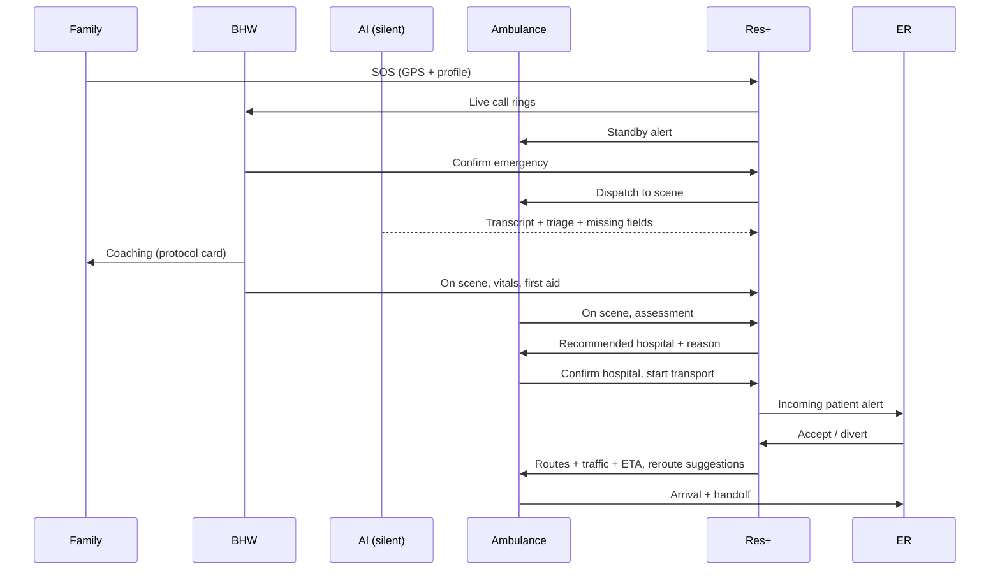

# Res+ Emergency Flow

Res+ connects families, BHWs, ambulance crews, and ERs on one live record of the emergency.
It works alongside 911 and LGU rescue. It does not replace them.

## Safety rules
1. **Dispatch never waits on AI.** AI only transcribes and suggests.
2. **People decide.** BHW confirms the emergency. Ambulance crew picks the hospital.
3. **No improvised AI medical advice.** First aid comes from vetted protocol cards, reviewed by a clinician.
4. **Never a dead end.** Every step has a timeout, an escalation, or a fallback.
5. **"Call 911" is always visible.**

## Roles
| Role | Does |
|---|---|
| Household | Taps SOS, talks on the call, follows BHW guidance |
| BHW | Enrolls patients, answers SOS, confirms emergency, coaches, gives first aid, fills missing info |
| Ambulance crew | Responds, assesses, picks hospital, picks route, fills missing info |
| ER staff | Accepts or diverts, prepares, updates bed/capability status |
| AI (background) | Silently transcribes, fills triage card, flags missing info |

## Flow (example: Lola Rosa, 68, suspected stroke, Quezon City)

### 0. Enrollment (before any emergency)
- During a routine home visit, the BHW enrolls high-risk patients (hypertension, diabetes, heart disease).
- Profile: name, age, sex, conditions, meds, allergies, home address, landmark notes.
- The family's phone is verified once by OTP and gets the SOS button. Consent is recorded.

### 1. SOS
- The family taps **SOS** once.
- Res+ sends GPS plus the home address and profile.
- A **live two-way call** rings the nearest on-duty BHW.
- The nearest ambulance gets a **standby** alert: it gets ready but doesn't move yet.

### 2. BHW answers and confirms
- A real person answers the call.
- The BHW taps **Confirm emergency**. The ambulance is dispatched and the BHW heads to the scene.
- AI silently transcribes the call and starts filling the triage card.
- For cardiac arrest or not breathing, the BHW confirms immediately and coaches CPR. No questions first.

### 3. Coaching on the way
- The BHW stays on the call while travelling.
- The BHW's screen shows the vetted protocol card for the condition (stroke, cardiac arrest, choking, bleeding, etc.).
- Stroke example: note the time it started, don't give food, drink, or medicine, lay her on her side if she vomits.

### 4. BHW on scene
- The BHW gives first aid within their scope.
- The BHW checks vitals (BP, and blood sugar if a glucometer is available) and fills missing fields.
- The BHW confirms the exact location for the ambulance if GPS is unclear.

### 5. Ambulance on scene: hospital pick
- The crew assesses the patient and fills any remaining missing fields.
- Once the patient is inside, Res+ recommends a hospital with its ETA and the reason for the pick:
  - **Default: nearest capable hospital** (stroke → CT, heart attack → cath lab, trauma → surgery).
  - **"Unstable" toggle → nearest ER** for stabilization (airway, arrest, uncontrolled bleeding).
- The crew confirms and **starts driving immediately**.

### 6. ER confirms or diverts
- The ER sees the incoming patient: profile, triage, vitals, onset time, ETA, live location.
- **Accept**: the ER prepares (e.g., CT, neuro on-call).
- **Divert**: Res+ re-matches to the next capable hospital and the crew is notified.
- **No response in 2 min**: Res+ auto-escalates to the next capable hospital.
- The ambulance never stops to wait.

### 7. En route
- The crew sees a **traffic heat map** with **2–3 alternate routes**, each with its ETA.
- If traffic changes, Res+ suggests a faster route. The crew accepts or ignores it.
- **Navigate** opens Google Maps or Waze for turn-by-turn directions.
- The ER watches the ambulance live. Missing info gets answered once and updates the ER instantly.

### 8. Arrival and close
- Handoff at the ER. The patient goes straight to the prepared team.
- The case closes with a full timeline: SOS → BHW confirm → dispatch → BHW on scene →
  ambulance on scene → hospital pick → accept/divert → arrival.
- The timeline feeds MHO reports.

## Statuses
`sos → confirmed → bhw_on_scene → ambulance_on_scene → transporting → arrived → closed`

## Escalations and fallbacks
| Situation | What Res+ does |
|---|---|
| BHW doesn't answer in 30s | Ring the next BHW |
| No BHW answers in 60s | Route to LGU dispatch |
| Call drops after SOS | Treat as real and dispatch |
| Agora call fails / weak data | Tap-to-call regular phone to the BHW |
| No ambulance available | Show it clearly, tell the family to call 911 (roadmap: neighboring LGU) |
| Bad GPS | Use home address + landmark notes. BHW confirms the location on the call |
| ER no response in 2 min | Auto-escalate to the next capable hospital |
| ER full | Divert → auto re-match |
| Not enrolled | "Call 911" button (roadmap: open SOS with stricter verification) |

## Optional add-on
- **Push-to-talk** (walkie-talkie mode) between BHW, crew, and ER for noisy places or weak signal.
  The live call stays the default for families.

## Sequence

## Open items
- Clinician review of all protocol cards
- Confirm destination rules (nearest capable vs nearest ER) with an EMS/ER doctor
